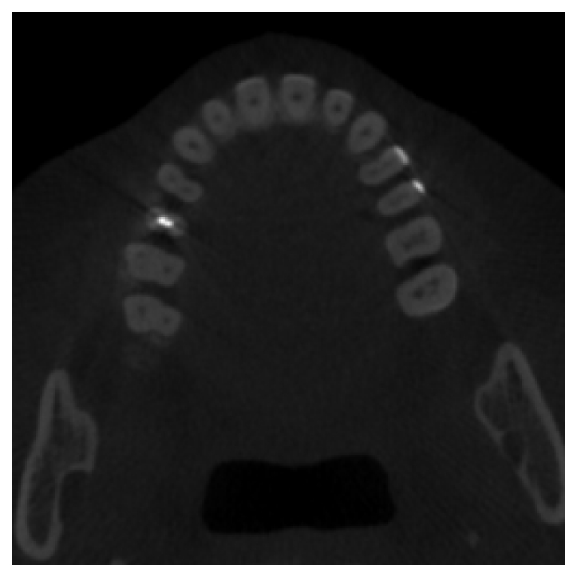

# Wavelet Tooth Diffusion: Guided 3D CBCT Synthesis

This repository contains the code for **Wavelet Tooth Diffusion**, a 3D conditional diffusion framework for dental CBCT imaging. The model integrates **wavelet-domain denoising diffusion** with **tooth-level conditioning** to enable realistic synthesis, reconstruction, and editing of CBCT scans.

📄 This paper has been accepted by MICCAI Workshop on Efficient Medical AI

If you find our work useful, please consider to ⭐ star this repository and 📝 cite our paper:

```bibtex
@article{said2025toothdiffusion,
  title     = {Tooth-Diffusion: Guided 3D CBCT Synthesis with Fine-Grained Tooth Conditioning},
  author    = {Said, Djafar Said and Gholamalizadeh, Torkan and Mehdipour Ghazi, Mostafa},
  journal   = {arXiv preprint arXiv:2508.14276},
  year      = {2025},
  url       = {https://arxiv.org/abs/2508.14276}
}
```

## Abstract
Despite the growing importance of dental CBCT scans for diagnosis and treatment planning, generating anatomically realistic scans 
with fine-grained control remains a challenge in medical image synthesis. In this work, we propose a novel conditional diffusion framework
for 3D dental volume generation, guided by tooth-level binary attributes that allow precise control over tooth presence and configuration. Our
approach integrates wavelet-based denoising diffusion, FiLM conditioning, and masked loss functions to focus learning on relevant anatomical
structures. We evaluate the model across diverse tasks, such as tooth addition, removal, and full dentition synthesis, using both paired and
distributional similarity metrics. Results show strong fidelity and generalization with low FID scores, robust inpainting performance, and SSIM
values above 0.91 even on unseen scans. These findings highlight the potential of controllable dental image synthesis for data augmentation,
simulation, and clinically informed AI applications.


*Fig. 1. Overview of the proposed framework. A guided diffusion model is used for 3D CBCT scan generation with editable tooth configurations.*

## Sample Results

<div align="center">
  <table>
    <tr>
      <td align="center"><br>Real Scan 1</td>
      <td align="center"><br>Synthetic Scan 1</td>
      <td align="center"><br>Real Scan 2</td>
      <td align="center"><br>Synthetic Scan 2</td>
    </tr>
  </table>
</div>

*Fig. 2. Qualitative comparison between generated CBCT scans and their corresponding real scans with complete dentition.*


---

<div align="center">
  <table>
    <tr>
      <td align="center">
        <br>
        <sub>Real (No Teeth 16, 1)</sub>
      </td>
      <td align="center">
        <br>
        <sub>Synthetic (Model Tries to Add 16, 1)</sub>
      </td>
    </tr>
  </table>
</div>

*Fig. 3. Qualitative example where the model tries to add synthetically previously absent teeth 16 and 1.*

---

<div align="center">
  <table>
    <tr>
      <td align="center">
        <br>
        <sub>Real (With Teeth 3, 2)</sub>
      </td>
      <td align="center">
        <br>
        <sub>Synthetic (Model Removes Teeth 3, 2)</sub>
      </td>
    </tr>
  </table>
</div>

*Fig. 4. Qualitative example where the model removes teeth 3 and 2 from the original scan.*


## Highlights

- **Wavelet-based diffusion** for efficient and high-resolution 3D CBCT volume generation.  
- **Fine-grained tooth conditioning** via presence vectors (32 teeth).  
- Supports multiple modes:
  - **Reconstruction** of CBCT volumes  
  - **Tooth addition** (inpainting missing teeth)  
  - **Tooth removal** (simulating absence for augmentation)  
- **Masked loss functions** to focus learning on tooth-bearing regions.  
- **Distributed training** with PyTorch DDP.

## Dependencies

Create and activate the environment with:

```bash
conda env create -f environment.yml
conda activate wdm
```

## Data Setup

Organize CBCT data as:

```
prep_data/
  train/
    Images/
    Labels/
  valid/
    Images/
    Labels/
  test/
    Images/
    Labels/
  MetaData.xlsx
```

- **Images/** and **Labels/** contain paired 3D CBCT volumes (`.nii.gz`).  
- **MetaData.xlsx** encodes patient information and tooth presence (1–32). 

## Usage

All training and sampling is handled via `run.sh`.


### Training

```bash
bash run.sh train teeth "" [teeth|""]
```

- `train` – training mode  
- `teeth` – task target  
- `""` – train from scratch (replace with checkpoint path to resume)  
- `[teeth|"" ]` – last argument can be either:  
  - `teeth` → enable tooth conditioning  
  - `""` (left empty) → no conditioning (synthetic generation)  

**GPU configuration:**  
At the **top of `run.sh`**, you must set which GPUs to use and how many. Training will always run with **DDP (Distributed Data Parallel)**, even if you specify a single GPU.

Example (`run.sh`):

```bash
# === GPU CONFIG ===
GPU=0,1              # GPUs to use (as seen in nvidia-smi), e.g. 0 for single GPU, 0,1 for two GPUs
NUMBERofGPUS=2       # must match the number of GPUs listed above
MASTERPORT=12345     # master port for distributed training (can be left as default)
```

### Sampling

```bash
bash run.sh sample teeth ./checkpoints/model.pt [teeth|""]
```

- `sample` – sampling mode  
- `teeth` – task target  
- `./checkpoints/model.pt` – path to trained checkpoint  
- `[teeth|"" ]` – last argument can be either:  
  - `teeth` → enable tooth conditioning  
  - `""` (left empty) → no conditioning (synthetic generation)  

Generated CBCT volumes are saved to `./results/`.

## Noise Scheduler

We implement a **VP-SDE inspired noise scheduler** (`vp_sde`) that improves both training efficiency and sampling speed.  

- **How to enable:**  
  In the `$COMMON` block of `run.sh`, set:  

  ```bash
  --noise_schedule=vp_sde
  ```  

  For regular diffusion, use:  

  ```bash
  --noise_schedule=linear
  ```  

- **Efficiency:**  
  VP-SDE achieves **comparable quality** across a wide range of steps (e.g., results are similar from `t=2` up to `t=1000`).  

- **Accelerated Sampling:**  
  Sampling with only `t=2` denoising steps achieves generation that is **several orders of magnitude faster** than standard approaches (`t=1000`) with comparable output quality.

- **Important:**  
  Remember to also update the values of `--diffusion_steps` and `--sampling_steps` in `run.sh` to match your desired training and sampling step counts.

## Util

The `util/` folder contains helper scripts for:

- `preproc_tooth_data.py`: Uses bounding box detection, clipping, and padding to fit CBCT volumes into a `256³` space.

## Scripts

Sampling scripts are divided into two folders:

### Reconstruction (`scripts/reconstruction/`):
- `generation_sample_add.py`
- `generation_sample_inpaint_all.py`
- `generation_sample_remove.py`

### Synthetic (`scripts/synthetic/`):
- `generation_sample_synth.py`

> **Note:** In `run.sh`, you need to manually update the line:
> 
> ```bash
> python scripts/reconstruction/generation_sample_add.py $SAMPLE $COMMON
> ```
>
> depending on which script you want to use (e.g., replace with `generation_sample_remove.py`, etc).

## Acknowledgements

Our code is based on / inspired by the following repositories:

* [https://github.com/pfriedri/cwdm](https://github.com/pfriedri/cwdm) (MIT License)
* [https://github.com/NVlabs/denoising-diffusion-gan](https://github.com/NVlabs/denoising-diffusion-gan) (NVIDIA License)

Thanks to the authors for making these resources openly available.
